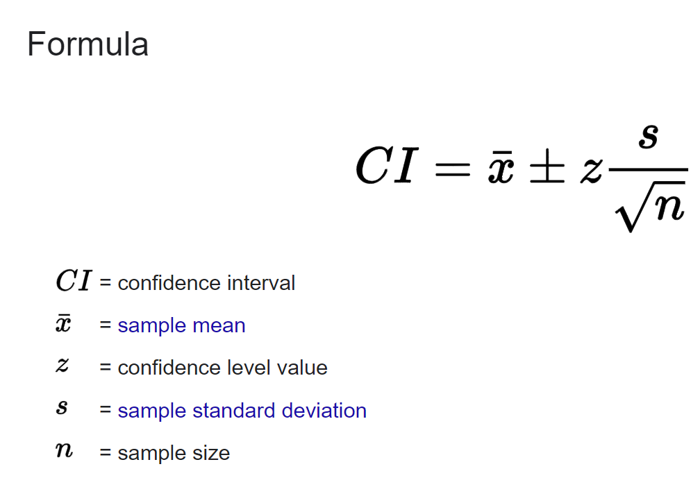

## Exercise 3: Confidence intervals for a random forest classifier

Given the problem description, this seemed like it was a regression problem and not a classification problem. I
interpreted it as a regression problem.

If we only need to provide a confidence interval, we can either use an existing
library ([such as this one](https://github.com/scikit-learn-contrib/forest-confidence-interval#readme), or implement it
ourselves.

To implement it ourselves, we can look up the formula to calculate confidence intervals
 which could be implemented as

```
x_mean = x.mean()
z = 0.95
s = x.std()
ci = x_mean +/- z*s/sqrt(n)
```

Reading about confidence intervals online brings up bootstrapping quite a bit. It's been a couple years since I took
statistics in university. This may be an alternative formula for calculating confidence intervals but more investigation
is needed. If there is someone at the company who knows more about statistics, I would also ask them for advice on how
they think this problem should be solved.

I would also meet with the end user beforehand. We need to first double check that they understand what they are asking
for. If this is a classification problem, they may actually be asking for the probabilities that each point is
classified as. For example, if the algorithm says that data point 1 is classified as Y (out of choices X,Y,Z), they may
want to know that the algorithm predicted gave probabilities of X=0,2, Y=0.7, Z=0.1. It could be that just using 1
standard deviation is good enough for them. If it is indeed, a confidence interval they want, we need to know what size
of confidence interval they want/is acceptable.
